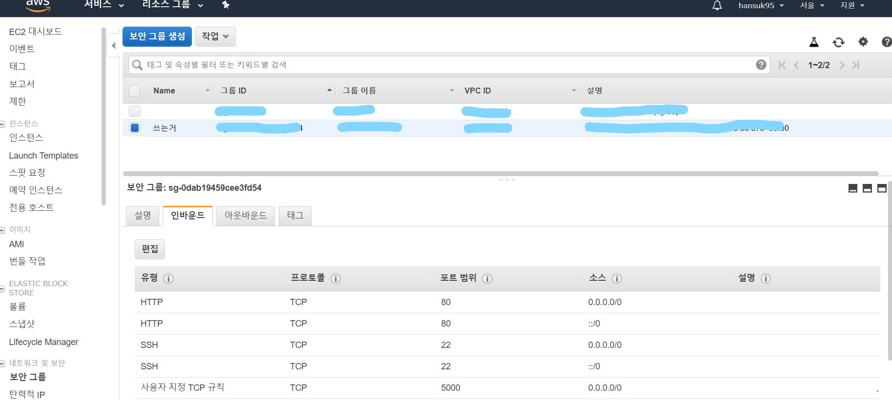
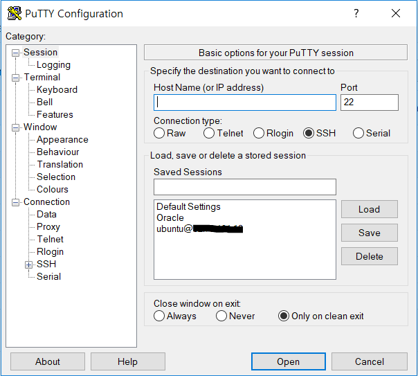
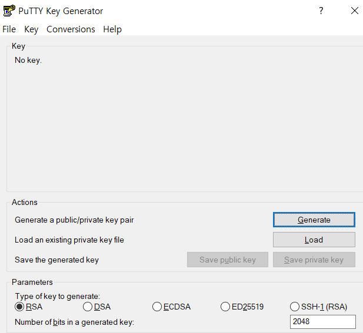
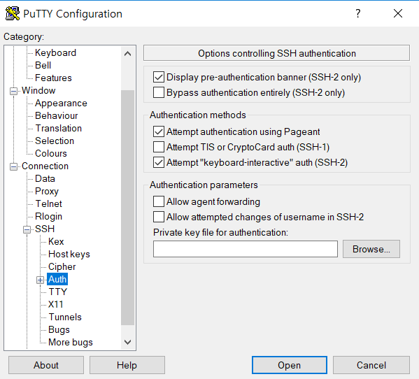
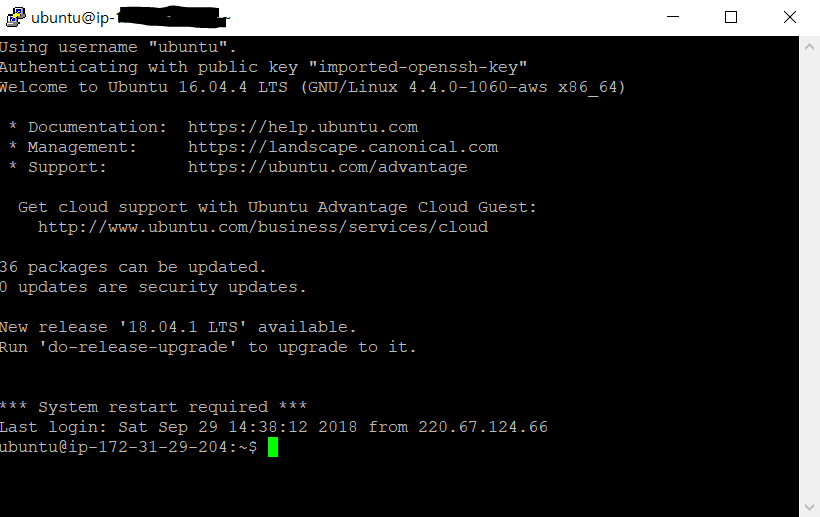

# VICER_SERVER

## 소개
컨트롤러와 카메라에서 정보를 받아 클라이언트에게 전달해주는 server

#### Server 기능
* 클라이언트가 작동시키는 컨트롤러의 정보를 받아 차량에서 정보를 전송 
* 카메라의 영상을 받아 client가 볼 수 있도록 영상을 전송

## 개발환경 설정 실행환경
AWS(Amazon Web Service) EC2와 python을 이용하여 Server를 구현하였다.

### AWS EC2 (Amazon Web Service Elastic Compute cloud)
* 아마존에서 제공하는 클라우드 컴퓨팅 서비스이다. 가입후 1년간 무료로 사용이 가능하다. 아래 링크에서 가입하도록 한다.
   * [가입] http://aws.amazon.com/free/ 
   
* 아래의 링크를 들어가면 현재 자신이 운용하고있는 EC2 머신들의 상태를 확인하고 관리 할 수 있다. 
   * [대시보드] https://ap-northeast-2.console.aws.amazon.com/ec2/v2/home?region=ap-northeast-2#Home:

   

   
* 이제 아마존에서 제공하는 공식 Document를 참조하여 서버를 운용하게 될 Cloud Computer를 생성하도록 한다. 서버를 돌려야하므로 리눅스 운영체제를 선택한다.
   * [EC2 생성하기] https://docs.aws.amazon.com/ko_kr/AWSEC2/latest/UserGuide/concepts.html
   
* EC2는 Cloud Computing을 이용한 가상 머신으로써 이에 접근 하려면 Public IP를 사용하여야 접근이 가능하다. 하지만 처음 EC2 인스턴스를 생성하게 되었을때 주어지는 Public IP는 접근성이 떨어지는 이메일 형식으로 되어있다.
   * [탄력적 IP] https://docs.aws.amazon.com/ko_kr/AWSEC2/latest/UserGuide/elastic-ip-addresses-eip.html

* 방금 생성하게된 EC2 인스턴스는 GUI환경이 아닌 리눅스 운영체제이다. 만들어진 인스턴스에 쉽게 접근하고 작업하기 위하여 Putty를 이용 할 것이다.(밑에서 자세한 설치 및 사용 방법을 기재 할 것이다.) 이를 위해서는 SSH 프로토콜 방식으로 제어를 해야하는데 보안그룹에서 인바운드를 설정 해주어야 한다.
   * [보안그룹] https://docs.aws.amazon.com/ko_kr/AWSEC2/latest/UserGuide/using-network-security.html
   

* 이제 인스턴스를 사용 할 수 있게되었다. 하지만 모든 사람들이 나의 인스턴스에 접속해선 안되기 때문에 비밀번호가 저장된 Key File을 받아야 한다.
   * [Key Pair] https://docs.aws.amazon.com/ko_kr/AWSEC2/latest/UserGuide/ec2-key-pairs.html
   * 이 키는 자신의 인스턴스에 접근하게 해주는 열쇠같은 파일이다. 다른사람, 또는 깃허브같은 오픈소스 웹에 올리게 될 경우 해커들이 악용 할 가능성이 있으므로 주의하여야 한다.

> 이로써 EC2 가상머신을 사용할 준비가 모두 끝났다. 추가적으로 설정해 주고싶은 사항은 위의 대시보드에서 언제든지 관리해 주면 된다.

### Putty
EC2는 Cloud 형태의 컴퓨터로써 웹상으로 존재를 확인할 수는 있지만 직접적으로 사용 할 수는 없다.   따라서 EC2 인스턴스를 사용하기 위해서는 터미널 에뮬레이터를 통하여 조종하여야 하는데 본 프로젝트에서는 무료로 배포되는 Putty를 사용하여 EC2 인스턴스를 다룰 것이다.
* [Putty] https://www.chiark.greenend.org.uk/~sgtatham/putty/latest.html
   * 자신의 운영체제에 맞는 버전으로 다운 받는다.
* [User Manual] https://the.earth.li/~sgtatham/putty/0.70/htmldoc/

#### Puttygen
위에서 받은 인스턴스의 키 파일은 putty에서 지원하는 키파일과 다른 포맷이다. 때문에 Putty를 이용하여 인스턴스에 접근하기 위해서는 Puttygen이라는 프로그램을 이용하여 바꿔 주어야 한다.
* [Puttygen] http://www.puttygen.com/
* 위의 링크에서 puttygen을 받아 인스턴스의 PEM파일을 Putty Private Key로 바꿔준다.

### 이제 Host Name에 위에서 ubuntu@"탄력적IP"를 입력하고(port 22 / SSH접속) putty private key파일을 아래 첫번째 사진의 key file 경로에 입력한 뒤 Open을 눌러주면 아래 두번째 사진과 같이 인스턴스에 SSH 방식으로 접속한 것을 확인 할 수 있다.

### Python
* 읽고 사용하기쉬운 Python을 사용하여 구현하였다. 
Python은 위의 AWS EC2 가상머신을 리눅스 운영체제로 구축할 경우 이미 설치 되어 있다.

